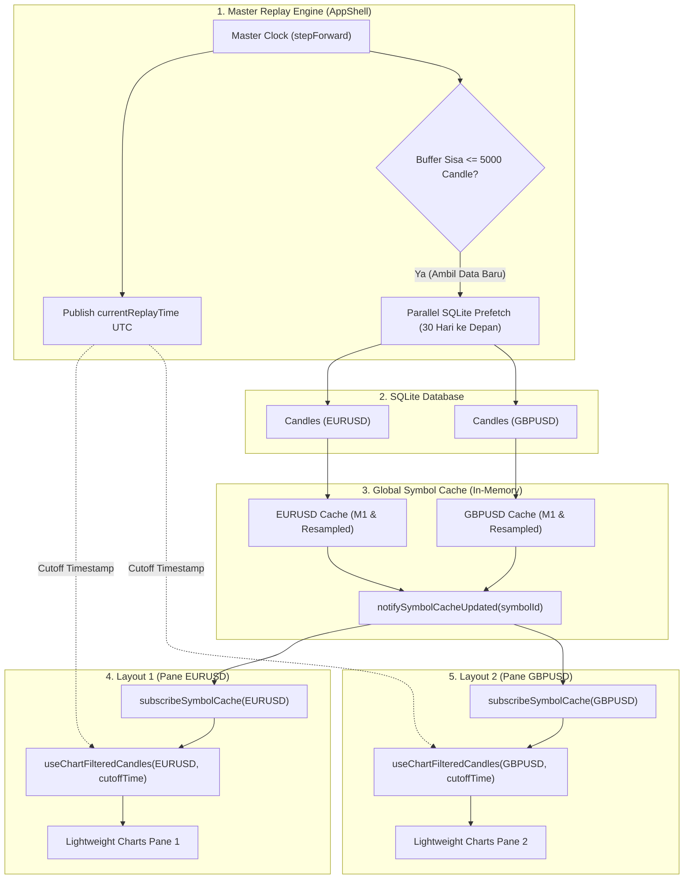

# Diagram Arsitektur Sinkronisasi Multi-Layout

Berikut adalah diagram alur bagaimana data candle mengalir secara serentak ke Layout 1 (EURUSD) dan Layout 2 (GBPUSD):

```mermaid
flowchart TD
    subgraph Engine["1. Master Replay Engine (AppShell)"]
        Clock["Master Clock (stepForward)"]
        PublishTime["Publish currentReplayTime UTC"]
        PrefetchCheck{"Buffer Sisa <= 5000 Candle?"}
        ParallelFetch["Parallel SQLite Prefetch (30 Hari ke Depan)"]
    end

    subgraph DB["2. SQLite Database"]
        DB_EUR["Candles (EURUSD)"]
        DB_GBP["Candles (GBPUSD)"]
    end

    subgraph Cache["3. Global Symbol Cache (In-Memory)"]
        CacheEUR["EURUSD Cache (M1 & Resampled)"]
        CacheGBP["GBPUSD Cache (M1 & Resampled)"]
        Broadcast["notifySymbolCacheUpdated(symbolId)"]
    end

    subgraph L1["4. Layout 1 (Pane EURUSD)"]
        L1_Sub["subscribeSymbolCache(EURUSD)"]
        L1_Filter["useChartFilteredCandles(EURUSD, cutoffTime)"]
        L1_Chart["Lightweight Charts Pane 1"]
    end

    subgraph L2["5. Layout 2 (Pane GBPUSD)"]
        L2_Sub["subscribeSymbolCache(GBPUSD)"]
        L2_Filter["useChartFilteredCandles(GBPUSD, cutoffTime)"]
        L2_Chart["Lightweight Charts Pane 2"]
    end

    Clock --> PublishTime
    Clock --> PrefetchCheck

    PrefetchCheck -- "Ya (Ambil Data Baru)" --> ParallelFetch
    ParallelFetch --> DB_EUR
    ParallelFetch --> DB_GBP

    DB_EUR --> CacheEUR
    DB_GBP --> CacheGBP
    CacheEUR --> Broadcast
    CacheGBP --> Broadcast

    Broadcast --> L1_Sub
    Broadcast --> L2_Sub

    PublishTime -. "Cutoff Timestamp" .-> L1_Filter
    PublishTime -. "Cutoff Timestamp" .-> L2_Filter

    L1_Sub --> L1_Filter --> L1_Chart
    L2_Sub --> L2_Filter --> L2_Chart
```
